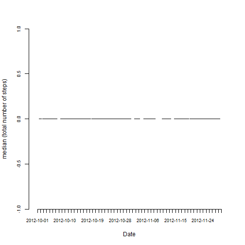

This is an assignment for fulfilling the assignment at [Coursera : Reproducible Research](https://www.coursera.org/course/repdata). 

## Data Name & Location

This assignment uses data that can be downloaded from location [Dataset: Activity monitoring data](https://d396qusza40orc.cloudfront.net/repdata%2Fdata%2Factivity.zip). We assume the user has downloaded this data and un-zipped it and has a file called activity.csv.

The variables included in this dataset are:  
1. steps: Number of steps taken in a 5minute (missing values are coded as NA).  
2. date: The date on which the measurement was taken in YYYY-MM-DD format.  
3. interval: Identifier for the 5minute interval in which measurement was taken  

The dataset is stored in a comma-separated-value (CSV) file and there are a total of 17,568 observations in this dataset. 


## Loading and preprocessing the data

We now read the data, assign the various columns in the data proper data-types and put it into a data.frame. 


```r
library(lattice)

# This is the mode of the various columns in the data.frame to be created later.
colClasses <- c("integer", "Date", "integer")

# Read the data into a data.frame called activity
activity  <- read.csv("./activity.csv", header = TRUE, colClasses = colClasses, sep = ",")
```
  


## What is mean total number of steps taken per day?

We now draw some inferences from the data and plot some graphs to help us visualize different aspects of it.

### Plot of the total number of steps taken each day  

```r
# Split the data according to data column.
s <- split(activity, activity$date)

# Add all the steps in each 5-minute interval for the day.
sum_df <- data.frame(steps = sapply(s, function(x) sum(x$steps, na.rm = TRUE)),
                     date  = names(s))

# Create a new date variable corresponding to the date on which the steps are being calculated.
sum_df$date <- as.Date(sum_df$date, "%Y-%m-%d")

# Display a histogram using the barchart function, that displays the total number
# of steps walked per day.
barchart(date~steps, data = sum_df, 
         xlab = "Steps", ylab = "Date", 
         main="Total number of 'Steps' taken each Day")
```

 

### Calculate the mean (total number of steps) taken per day

  
We first calculate the mean of all the steps taken across all intervals per day and plot a barplot of it.  


```r
# Mean of all the steps in each 5-minute interval for the day.
mean_df <- data.frame(steps = sapply(s, function(x) mean(x$steps, na.rm = TRUE)))

#hist(mean_df$steps, breaks = nrow(mean_df))

# Plot of the mean number of steps walked for all the days.
barplot(mean_df$steps, names.arg = rownames(mean_df), beside=TRUE, col="lightblue", cex.axis = 0.75, cex.names = 0.75, axis.lty = 1, xlab = "Date", ylab = "mean (total number of steps)")
```

 
 
### Calculate the median (total number of steps) taken per day
  
We next do the same but instead calculate the median of all the steps taken across all intervals per day and plot a barplot of it as well.


```r
median_df <- data.frame(steps = sapply(s, function(x) median(x$steps, na.rm = TRUE)))

barplot(median_df$steps, names.arg = rownames(median_df), beside=TRUE, col="pink", cex.axis = 0.75, cex.names = 0.75, axis.lty = 1, xlab = "Date", ylab = "median (total number of steps)")
```

 

Note how the median is very close to 0 but not the mean. That's so because the number of steps walked per 5-minute interval in each day is very assymetrical and non-normal.
 
## What is the average daily activity pattern?
 
  
We next make a time series plot (i.e. type = "l" ) of the 5-minute interval on (x-axis) and the average number of steps taken, averaged across all days on (y-axis).


```r
# Split the data according to 5-minute interval column.
s <- split(activity, activity$interval)

# Calculate the mean for all the days per each 5-minute interval.
mean_5min_df <- data.frame(steps = sapply(s, function(x) mean(x$steps, na.rm = TRUE)))

# Plot a graph with x-axis (5-minute interval) and y-axis (Average Number of Steps).
plot(mean_5min_df$steps, 
     type="l", lwd = 1.15, col="blue", 
     cex.axis = 0.65,
     cex.lab = 0.85, col.lab = "darkviolet",
     xlab = "(5-minute) Interval", ylab = "Average number of Steps", 
     cex.main= 0.95, col.main = "tomato",
     main = "Average number of Steps (Averaged across all Days) per Interval (5-min)", 
    )

# We also add a vertical line that shows the the 5-minute interval that has,
# the maximum number of steps.
abline(v=which.max(mean_5min_df$steps), col = "red",  lwd=1.85)
```

 

The 5-minute interval 104, on average (across all the days in the dataset), contains the maximum number of steps which is 206.


## Imputing missing values

Note that there are a number of days/intervals where there are missing values (coded as NA ). The presence of missing days may introduce bias into some calculations or summaries of the data.


```r
tt <- complete.cases(activity)
total_rows_with_NA <- sum(!tt)
```

There are in all 2304 rows with missing data.

We fill the missing data with the mean for that 5minute interval.
  

```r
table_with_missing_entries <- is.na(activity$steps)

steps_filled <- ifelse (table_with_missing_entries, mean_5min_df$steps, activity$steps)
```

We next create a new dataset that is equal to the original dataset but with the missing data filled in.


```r
activity_new <- activity

activity_new$steps = steps_filled
```

We make a histogram of the total number of steps taken each day and calculate the mean and median total number of steps taken per day.


```r
hist(activity_new$steps)
```

 

```r
s <- split(activity_new, activity_new$date)

mean_df_new <- data.frame(steps = sapply(s, function(x) mean(x$steps)))

median_df_new <- data.frame(steps = sapply(s, function(x) median(x$steps)))
```


## Are there differences in activity patterns between weekdays and weekends?

We create a new factor variable in the dataset with two levels "weekday" and "weekend" indicating whether a given date is a weekday or weekend day.


```r
# The list of weekdays
weekday <- c("Monday", "Tuesday", "Wednesday", "Thursday", "Friday")
  
# The list of weekends
weekend <- c("Saturday", "Sunday")

# Create a new column 'day' denoting weekday or weekend
activity_new$day <- ifelse(weekdays(activity_new$date) %in% weekday, "weekday", "weekend")

# Convert the 'day' column to a factor variable
activity_new$day <- as.factor(activity_new$day)
```

We make a panel plot containing a time series plot (i.e. type = "l" ) of the 5-minute interval on (x-axis) and the average number of steps taken, averaged across all 'weekday' days or 'weekend' days (y-axis).


```r
xyplot(steps ~ interval | day, data = activity_new, layout = c(1, 2), type = "l", xlab = "Interval", ylab = "Number of steps")
```

 
